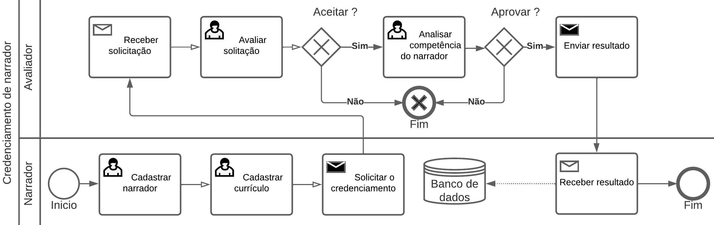

# WebTeca

**Bryan Rosenberg de Abreu, bryanalfa0909@gmail.com**

**Gabriel Afonso Infante Vieira, gabrielvieira200481@gmail.com**

**Gabriel Alejandro Figueiro Galindo, gabriel.alejandro@sga.pucminas.br**

**João Paulo Goulart Machado, jpcapitolio@hotmail.com**

**Vitória Ye Miao, vitoria.miao@sga.pucminas.br**

---

Professores:

**Hugo Bastos de Paula**

**Eveline Alonso Veloso**

**Thiago Augusto Nicolini Silva**

---

_Curso de Engenharia de Software, Unidade Praça da Liberdade_

_Instituto de Informática e Ciências Exatas – Pontifícia Universidade de Minas Gerais (PUC MINAS), Belo Horizonte – MG – Brasil_

---

_Nosso projeto é uma biblioteca virtual voltada para áudio books, com o principal objetivo auxiliar pessoas analfabetas, crianças , cegos, baixa disponibilidade de tempo entre outros pessoas na leitura e absorção dos livros. Devido a alta dinamicidade dos dias atuais, se torna cada vez mais difícil para as pessoas sentarem e lerem um livro. Desta forma, os áudio books vem se tornando uma opção mais viável para os leitores já ativos e os que desejam começar._

---

## 1. Introdução

    1.1 Contextualização

Em 2022, o mercado global de audiolivros foi avaliado em US$ 5.364,9 milhões e devese se eperar que ele cresça com uma CAGR (Taxa de crescimento anual composta) de 26,3% de 2023 a 2030.**[1.1]** Esses livros estão se tornando cada vez mais populares, devido aos multiplos beneficios que eles oferem em comparação aos ebooks e aos livros de papel. Assim, perante ao crescimento do mercado de audiobooks, nosso projeto busca facilitar o acesso aos audiolivros para aqueles que mais necessitam.

    1.2 Problema

De acordo com o IBOPE em 2019, o Brasil perdeu 4,6 milhões de leitores nos últimos quatro anos. Além disso, segundo o IBGE de 2010, há no país mais de 6,5 milhões de pessoas que não conseguem ver de forma alguma ou que têm grande dificuldade, o equivalente a 3,5% da população. Desse total, 582,6 mil são incapazes de enxergar.**[1.2]**

    1.3 Objetivo geral

Desenvolver um software de biblioteca virtual voltada para o publico de audiobooks.

        1.3.1 Objetivos específicos
 - Selecionar livros renomados.
 - Garantir acessibilidade financeira do leitor.
 - Facilitar a navdegção de usuarios deficientes.
 - Garantir a segurança do cliente no momento da compra/aluguel.

        1.4 Justificativas

Devido a alta dinamicidade dos dias atuais, se torna cada vez mais difícil para as pessoas sentarem e lerem um livro. Desta forma os áudio books vem se tornando uma
opção mais viável para os leitores já ativos e os que desejam começar.

## 2. Participantes do processo

 - Leitores, englobando pessoas com deficiência visual, semi analfabetos, pessoas que não conseguem dedicar o tempo necessário para a leitura, idosos com dificuldade de leitura, estrangeiros que buscam entender melhor a lingua portuguêsa escutando, entre outros.

 - Autores independentes, que desejam disponibilar sua obra em formato de audiobook.

 - Editoras, com o intuito de disponibilizar suas obras já publicadas para pessoas que não possuem condições de lelas.

 - Narradores, que atendem a solicitação dos leitores sobre livros desejados que ainda não possuem nenhum tipo de narração em diferentes plataformas.

 - Avaliadores, participante da nossa equipe responsável por avaliar usuários que desejam ser narradores credenciados.

## 3. Modelagem do processo de negócio

## 3.1. Análise da situação atual

Atualmente existem livros limitados disponibilizados em audiobooks e em plataformas que não são pensadas para pessoas com deficiência visual. Apesar dos vários algoritmos disponíveis para leitura de arquivos, a voz robótica proveniente dos mesmos acaba prejudicando a experiência do usuário. Enquanto isso, muitas pessoas com deficiência visual continuam enfrentando barreiras para acessar o conteúdo literário, o que é uma grande limitação para a sua formação cultural e intelectual.

Caso um usuário deseje escutar um livro que não esteja disponível em áudio, ele deverá entrar em contato com a editora ou com a plataforma de audiobook escolhida, enviando uma solicitação para a narração do mesmo, o que pode levar um tempo considerável para que seja atendido.

## 3.2. Descrição Geral da proposta

Nosso projeto é um aplicativo chamado "webteca", ele ira permitir que o usuário pesquise, alugue e acesse audiolivros que ele desaja ler. Caso o livro que o usuário queira não esteja disponivel na biblioteca, ele devera fazer um pedido no site, esse pedido será atendido por um dos narradores do site, um usuário autenticado, que possui a permissão de atender pedidos e criar o audiolivros. Uma vez que o pedido seja atendido e o audibook seja criado, ele devera ser postado no site, onde podera ser alugado por outros usuários. Como compensação, o narrador recebera uma parcela do dinheiro para cada vez que o audiolivro é alugado. Para reinforçar a qualidade do produto, usuários poderão avaliar os audilivros que eles alugam.
Como nosso projeto tem como público alvo pessoas com deficiências visuais e anafalbetos, nosso aplicativo também tera uma interfaçe que seja adequada e intuitiva para essas pessoas.

## 3.3. Modelagem dos Processos

### 3.3.1 Processo 1 – Cadastrar leitor na plataforma

O cadastro de leitor na plataforma consiste no processo de cadastro de novos usuários ou caso já seja cadastrado, no login. Ao cadastrar será ofertado dois planos, um premium pago sendo necessário o cadastro de um cartão de crédito, e um gratuito onde será necessario apenas o preenchimento das informações pessoais.

### 3.3.2 Processo 2 – Credenciamento de narrador 

O Credenciamento do narrador consiste no processo de cadastrar novos narradores qualificados em nosso site, os quais serão armazenados em nosso banco de dados para receberem ofertas no processo de publicação das narrações.

### 3.3.3 Processo 3 – Publicação da narração 

Narradores são usuários autenticados que possuem o direito e habilidade de aceitarem pedidos de outros usários. Caso o narrador aceite um pedido, ele devera ler o livro no pedido e criar um audiobook desse livro, o qual ele também devera enviar para a Webteca.  Uma vez que isso seja feito, o novo audiolivro estara disponivel para ser alugado por todos os outros usuários do site e em troca o narrador recebera uma fração do lucro gerado pelo livro.

### 3.3.4 Processo 4 – Processo de leitura 

A Webteca é um aplicativo cujo propósito principal é tornar audiolivros mais acessiveis para o publico. Para atingir esse objetivo, usuários poderão pesquisar livros que eles desejam, alugar, ler e avaliar. Caso o livro desejado não esteja disponível, o usuário podera solicitar uma narração e caso o usuário queira parar de ler ele podera pedir uma pausa e depois continuar lendo de onde parou. 

### 3.3.5 Processo 5 - Remoção de narrador
Em certos casos, pode ser necessário remover um narrador do banco de dados. Isso pode ocorrer caso o narrador demostre comportamento inadequado, não profissional e/ou tenha violado os termos de serviço da Webteca.

## 4. Projeto da Solução

### 4.1. Detalhamento das atividades

Descrever aqui cada uma das propriedades das atividades de cada um dos processos. Devem estar relacionadas com o modelo de processo apresentado anteriormente.

#### Processo 1 – Cadastrar leitor na plataforma

**Realizar login**

| **Campo** | **Tipo** | **Restrições** | **Valor default** |
| --- | --- | --- | --- |
| Email | Caixa de Texto | Formato de e-mail |  |
| Senha | Caixa de Texto | Mínimo de 8 caracteres |   |

**Cadastrar leitor**

| **Campo** | **Tipo** | **Restrições** | **Valor default** |
| --- | --- | --- | --- |
| Nome | Caixa de Texto |  |  |
| Email | Caixa de Texto | Formato de e-mail |  |
| Senha | Caixa de Texto | Mínimo de 8 caracteres |  |
| Confirmação de senha | Caixa de texto | Identica a anterior |  |
| CPF | Número | 11 Numeros |  |

**Escolher metodo de pagamento**

| **Campo** | **Tipo** | **Restrições** | **Valor default** |
| --- | --- | --- | --- |
| Opção | Seleção unica | Crédito/Debito/Pix/Boleto | Cartão de crédito |

#### Processo 2 – Credenciamento de narrador

**Cadastrar narrador**

| **Campo** | **Tipo** | **Restrições** | **Valor default** |
| --- | --- | --- | --- |
| Nome | Caixa de Texto |  |  |
| Email | Caixa de Texto | Formato de e-mail |  |
| Celular | Número | 11 Números |  |
| Senha | Caixa de Texto | Mínimo de 8 caracteres |  |
| Confirmação de senha | Caixa de texto | Identica a anterior |  |
| CPF | Número | 11 Números |  |
| Currículo | Arquivo | |  |

**Analisar competência do narrador**

| **Campo** | **Tipo** | **Restrições** | **Valor default** |
| --- | --- | --- | --- |
| Nome | Caixa de Texto | |  |
| Currículo | Arquivo | |  |
| Aprovado | Seleção unica |Sim ou Não | Sim |

#### Processo 3 – Publicação da narração

**Escolha do livro**

| **Campo** | **Tipo** | **Restrições** | **Valor default** |
| --- | --- | --- | --- |
| pesquisar nome do livro | tabela |  |  |
| pesquisar nome do autor | tabela |  |  |
| pesquisar tema | tabela |  |  |
| pesquisar edição | tabela |  |  |
| pesquisar idioma | tabela |  |  |
|  selecionar livro  |  botão  |     |

**Postar narração**

| **Campo** | **Tipo** | **Restrições** | **Valor default** |
| --- | --- | --- | --- |
| Adicionar arquivo | Arquivo | Mp3 |  |
|  Aceitar  |  Seleção única  |  Sim ou Não   |

#### Processo 4 - Processo de leitura

**Pesquisar Livro**

| **Campo** | **Tipo** | **Restrições** | **Valor default** |
| --- | --- | --- | --- |
| Pesquisar Livro | Caixa de Texto | Nome do livro, nome do escritor ou categoria |  |
|  Nome do livro  |  Tabela  |     |
|  Nome do escritor  |  Tabela  |     |
|  Categoria   |  Tabela  |     |

#### Processo 5 - Remoção de narrador

**Enviar uma reclamação sobre um narrador**

| **Campo** | **Tipo** | **Restrições** | **Valor default** |
| --- | --- | --- | --- |
| Nome do narrador | Caixa de Texto |  |  |
| Reclamação | Caixa de Texto |  |  |

**Avaliar se a reclamação é válida**

| **Campo** | **Tipo** | **Restrições** | **Valor default** |
| --- | --- | --- | --- |
| Nome do narrador | Caixa de Texto |  |  |
| Nome do leitor | Caixa de Texto |  | Nome de usuário do leitor |
| Reclamação | Caixa de Texto |  |  |
| Validar | Seleção única | Sim ou Não |  |

### 4.2. Tecnologias

 - Github como repositório
 - Lucid como ferramenta para desenho dos processos
 - VS Code como ambiente de programação
 - MySQL Workbench como ferramenta para criação do modelo de dados

As linguagens utilizadas foram:
 - NodeJS
 - HTML
 - CSS
 - JavaScript

## 5. Modelo de dados

## 6. Indicadores de desempenho

Apresente aqui os principais indicadores de desempenho e algumas metas para o processo. Atenção: as informações necessárias para gerar os indicadores devem estar contempladas no diagrama de classe. Colocar no mínimo 5 indicadores.

Usar o seguinte modelo:

| **Indicador** | **Objetivos** | **Descrição** | **Cálculo** | **Fonte dados** | **Perspectiva** |
| --- | --- | --- | --- | --- | --- |
| Percentual reclamações | Avaliar quantitativamente as reclamações | Percentual de reclamações em relação ao total atendimento |   | Tabela reclamações | Aprendizado e Crescimento |
| Taxa de Requisições abertas | Melhorar a prestação de serviços medindo a porcentagem de requisições | Mede % de requisições atendidas na semana |  | Tabela solicitações | Processos internos |
| Taxa de entrega de material | Manter controle sobre os materiais que estão sendo entregues | Mede % de material entregue dentro do mês |   | Tabela Pedidos | Clientes |

Obs.: todas as informações para gerar os indicadores devem estar no diagrama de classe **a ser proposto**

## 7.Sistema desenvolvido

Faça aqui uma breve descrição do software e coloque as principais telas com uma explicação de como usar cada uma.

## 8. Conclusão

Apresente aqui a conclusão do seu trabalho. Discussão dos resultados obtidos no trabalho, onde se verifica as observações pessoais de cada aluno. Poderá também apresentar sugestões de novas linhas de estudo.

# REFERÊNCIAS

**[1.1]** - _Audiobooks Market Size, Share & Trends Analysis Report By Genre, By Preferred Device (Smartphones, Laptops & Tablets, Personal Digital Assistants), By Distribution Channel, By Target Audience, By Region, And Segment Forecasts, 2023 - 2030._

**[1.2]** - _Louis Braille Escola para Deficientes Visuais, Estatísticas sobre deficiência visual no Brasil e no Mundo, 2020._

# APÊNDICES

**Colocar link:**

Do código (armazenado no repositório);

Dos artefatos (armazenado do repositório);

Da apresentação final (armazenado no repositório);

Do vídeo de apresentação (armazenado no repositório).

