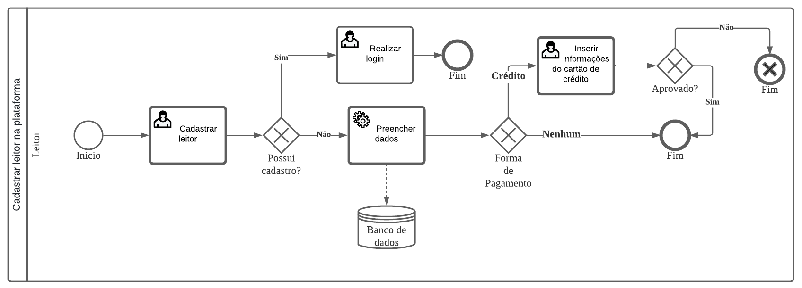
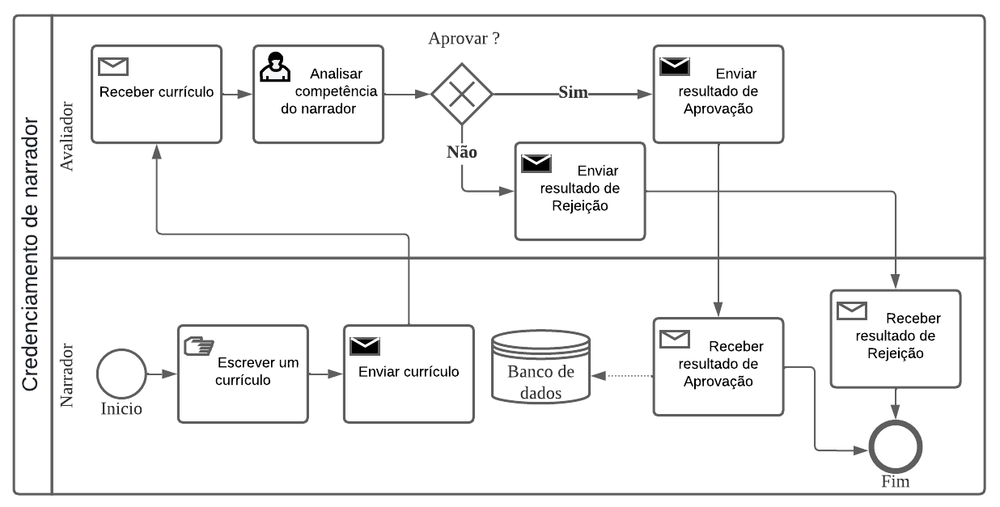
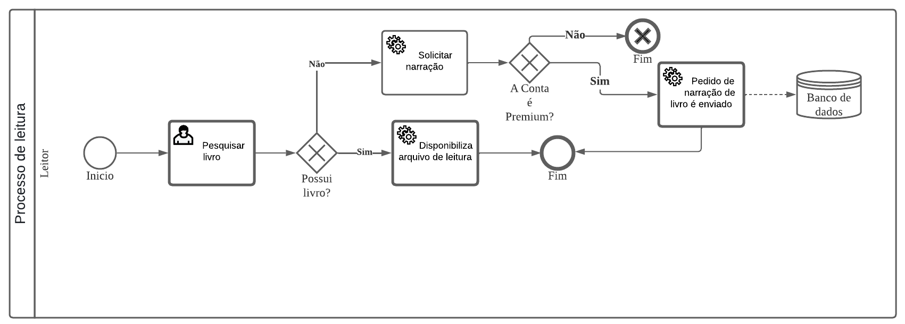

# WebTeca

**Bryan Rosenberg de Abreu, bryanalfa0909@gmail.com**

**Gabriel Afonso Infante Vieira, gabrielvieira200481@gmail.com**

**Gabriel Alejandro Figueiro Galindo, gabriel.alejandro@sga.pucminas.br**

**João Paulo Goulart Machado, jpcapitolio@hotmail.com**

**Vitória Ye Miao, vitoria.miao@sga.pucminas.br**

---

Professores:

**Hugo Bastos de Paula**

**Eveline Alonso Veloso**

**Thiago Augusto Nicolini Silva**
# WebTeca

**Bryan Rosenberg de Abreu, bryanalfa0909@gmail.com**

**Gabriel Afonso Infante Vieira, gabrielvieira200481@gmail.com**

**Gabriel Alejandro Figueiro Galindo, gabriel.alejandro@sga.pucminas.br**

**João Paulo Goulart Machado, jpcapitolio@hotmail.com**

**Vitória Ye Miao, vitoria.miao@sga.pucminas.br**

---

Professores:

**Hugo Bastos de Paula**

**Eveline Alonso Veloso**

**Thiago Augusto Nicolini Silva**

---

_Curso de Engenharia de Software, Unidade Praça da Liberdade_

_Instituto de Informática e Ciências Exatas – Pontifícia Universidade de Minas Gerais (PUC MINAS), Belo Horizonte – MG – Brasil_

---

_Nosso projeto é uma biblioteca virtual voltada para áudio books, com o principal objetivo auxiliar pessoas analfabetas, crianças, cegos, baixa disponibilidade de tempo entre outros pessoas na leitura e absorção dos livros. Devido a alta dinamicidade dos dias atuais, se torna cada vez mais difícil para as pessoas sentarem e lerem um livro. Desta forma, os áudio books vem se tornando uma opção mais viável para os leitores já ativos e os que desejam começar._

---

## 1. Introdução

    1.1 Contextualização

Em 2022, o mercado global de audiolivros foi avaliado em US$ 5.364,9 milhões e devese se eperar que ele cresça com uma CAGR (Taxa de crescimento anual composta) de 26,3% de 2023 a 2030.**[1.1]** Esses livros estão se tornando cada vez mais populares, devido aos multiplos beneficios que eles oferem em comparação aos ebooks e aos livros de papel. Assim, perante ao crescimento do mercado de audiobooks, nosso projeto busca facilitar o acesso aos audiolivros para aqueles que mais necessitam.

    1.2 Problema

De acordo com o IBOPE em 2019, o Brasil perdeu 4,6 milhões de leitores nos últimos quatro anos. Além disso, segundo o IBGE de 2010, há no país mais de 6,5 milhões de pessoas que não conseguem ver de forma alguma ou que têm grande dificuldade, o equivalente a 3,5% da população. Desse total, 582,6 mil são incapazes de enxergar.**[1.2]**

    1.3 Objetivo geral

Desenvolver um software de biblioteca virtual voltada para o publico de audiobooks.

        1.3.1 Objetivos específicos
 - Selecionar livros renomados.
 - Garantir acessibilidade financeira do leitor.
 - Facilitar a navegação de usuarios deficientes.
 - Garantir a segurança do cliente no momento da compra/aluguel.

        1.4 Justificativas

Devido a alta dinamicidade dos dias atuais, se torna cada vez mais difícil para as pessoas sentarem e lerem um livro. Desta forma os áudio books vem se tornando uma
opção mais viável para os leitores já ativos e os que desejam começar.

## 2. Participantes do processo

 - Leitores, englobando pessoas com deficiência visual, semi analfabetos, pessoas que não conseguem dedicar o tempo necessário para a leitura, idosos com dificuldade de leitura, estrangeiros que buscam entender melhor a lingua portuguêsa escutando, entre outros.

 - Autores independentes, que desejam disponibilar sua obra em formato de audiobook.

 - Editoras, com o intuito de disponibilizar suas obras já publicadas para pessoas que não possuem condições de lelas.

 - Narradores, que atendem a solicitação dos leitores sobre livros desejados que ainda não possuem nenhum tipo de narração em diferentes plataformas.

 - Avaliadores, participante da nossa equipe responsável por avaliar usuários que desejam ser narradores credenciados.

## 3. Modelagem do processo de negócio

## 3.1. Análise da situação atual

Atualmente existem livros limitados disponibilizados em audiobooks e em plataformas que não são pensadas para pessoas com deficiência visual. Apesar dos vários algoritmos disponíveis para leitura de arquivos, a voz robótica proveniente dos mesmos acaba prejudicando a experiência do usuário. Enquanto isso, muitas pessoas com deficiência visual continuam enfrentando barreiras para acessar o conteúdo literário, o que é uma grande limitação para a sua formação cultural e intelectual.

Caso um usuário deseje escutar um livro que não esteja disponível em áudio, ele deverá entrar em contato com a editora ou com a plataforma de audiobook escolhida, enviando uma solicitação para a narração do mesmo, o que pode levar um tempo considerável para que seja atendido.

## 3.2. Descrição Geral da proposta

Nosso projeto é um aplicativo chamado "webteca", ele ira permitir que o usuário pesquise, alugue e acesse audiolivros que ele desaja ler. Caso o livro que o usuário queira não esteja disponivel na biblioteca, ele devera fazer um pedido no site, esse pedido será atendido por um dos narradores do site, um usuário autenticado, que possui a permissão de atender pedidos e criar o audiolivros. Uma vez que o pedido seja atendido e o audibook seja criado, ele devera ser postado no site, onde podera ser alugado por outros usuários. Como compensação, o narrador recebera uma parcela do dinheiro para cada vez que o audiolivro é alugado. Para reinforçar a qualidade do produto, usuários poderão avaliar os audilivros que eles alugam.
Como nosso projeto tem como público alvo pessoas com deficiências visuais e anafalbetos, nosso aplicativo também tera uma interfaçe que seja adequada e intuitiva para essas pessoas.

## 3.3. Modelagem dos Processos

### 3.3.1 Processo 1 – Cadastrar leitor na plataforma

O cadastro de leitor na plataforma consiste no processo de cadastro de novos usuários ou caso já seja cadastrado, no login. Ao cadastrar será ofertado dois planos, um premium pago sendo necessário o cadastro de um cartão de crédito, e um gratuito onde será necessario apenas o preenchimento das informações pessoais.

### 3.3.2 Processo 2 – Credenciamento de narrador 

O Credenciamento do narrador consiste no processo de cadastrar novos narradores qualificados em nosso site, os quais serão armazenados em nosso banco de dados para receberem ofertas no processo de publicação das narrações.

### 3.3.3 Processo 3 – Publicação da narração 

Narradores são usuários autenticados que possuem o direito e habilidade de aceitarem pedidos de outros usários. Caso o narrador aceite um pedido, ele devera ler o livro no pedido e criar um audiobook desse livro, o qual ele também devera enviar para a Webteca.  Uma vez que isso seja feito, o novo audiolivro estara disponivel para ser alugado por todos os outros usuários do site e em troca o narrador recebera uma fração do lucro gerado pelo livro.

### 3.3.4 Processo 4 – Processo de leitura 

A Webteca é um aplicativo cujo propósito principal é tornar audiolivros mais acessiveis para o publico. Para atingir esse objetivo, usuários poderão pesquisar livros que eles desejam, alugar, ler e avaliar. Caso o livro desejado não esteja disponível, o usuário podera solicitar uma narração e caso o usuário queira parar de ler ele podera pedir uma pausa e depois continuar lendo de onde parou. 

### 3.3.5 Processo 5 - Remoção de Livro
Em certos casos, pode ser necessário remover um livro do banco de dados. Isso pode ocorrer caso o audiolivro em questão não possua uma qualidade adequada e/ou tenha violado os termos de serviço da Webteca.

## 4. Projeto da Solução

### 4.1. Detalhamento das atividades

#### Processo 1 – Cadastrar leitor na plataforma

**Realizar login**

| **Campo** | **Tipo** | **Restrições** | **Valor default** |
| --- | --- | --- | --- |
| Nome de usuário | Caixa de Texto |  |  |
| Senha | Caixa de Texto | Mínimo de 8 caracteres |  |

**Cadastrar leitor**

| **Campo** | **Tipo** | **Restrições** | **Valor default** |
| --- | --- | --- | --- |
| Nome | Caixa de Texto |  |  |
| CPF | Número | 11 Numeros |  |
| Email | Caixa de Texto | Formato de e-mail |  |
| Senha | Caixa de Texto | Mínimo de 8 caracteres |  |
| Forma de Pagamento | Seleção única | Crédito/Nenhum |  |

#### Processo 2 – Credenciamento de narrador

**Enviar pedido de credenciamento de narrador**

| **Campo** | **Tipo** | **Restrições** | **Valor default** |
| --- | --- | --- | --- |
| Currículo | Arquivo | Tem que estár no formato pdf |  |

**Analisar competência do narrador**

| **Campo** | **Tipo** | **Restrições** | **Valor default** |
| --- | --- | --- | --- |
| Currículo | Arquivo | |  |
| Data de Envio | Caixa de texto |  | Data em que o pedido foi enviado |
| Data de Resposta | Caixa de texto |  | Data em que o pedido foi avaliado |
| Tempo Gasto | Caixa de texto |  | Diferença entre Data de Envio e Resposta |
| Resposta | Caixa de texto |  | Resposta do pedido |
| Ação | Seleção unica | Aprovar ou Rejeitar |  |

#### Processo 3 – Publicação da narração

**Postar Narração**

| **Campo** | **Tipo** | **Restrições** | **Valor default** |
| --- | --- | --- | --- |
| Nome do autor | Caixa de Texto |  |  |
| Tema | Caixa de Texto |  |  |
| Edição | Caixa de Texto |  |  |
| Idioma | Caixa de Texto |  |  |
| Audio | arquivo de audio | formato mp3 |  |
| Capa | imagem | formato jpeg |  |
| Descrição | Caixa de Texto |  |  |

#### Processo 4 - Processo de leitura

**Pesquisar Livro**

| **Campo** | **Tipo** | **Restrições** | **Valor default** |
| --- | --- | --- | --- |
| Pesquisar | Caixa de Texto | Nome do livro |  |

**Solicitar Narração**

| **Campo** | **Tipo** | **Restrições** | **Valor default** |
| --- | --- | --- | --- |
| Nome do Livro | Caixa de Texto |  |  |

#### Processo 5 - Remoção de livro

**Enviar uma pedido de remoção de livro**

| **Campo** | **Tipo** | **Restrições** | **Valor default** |
| --- | --- | --- | --- |
| Nome do livro | Caixa de Texto |  |  |
| Motivo de remoção | Caixa de Texto |  |  |

**Avaliar se o pedido é válido**

| **Campo** | **Tipo** | **Restrições** | **Valor default** |
| --- | --- | --- | --- |
| Nome do livro | Caixa de Texto |  |  |
| Motivo de remoção | Caixa de Texto |  |  |
| Data de Envio | Caixa de texto |  | Data em que o pedido foi enviado |
| Data de Resposta | Caixa de texto |  | Data em que o pedido foi avaliado |
| Tempo Gasto | Caixa de texto |  | Diferença entre Data de Envio e Resposta |
| Resposta | Caixa de texto |  | Resposta do pedido |
| Ação | Seleção única | Aceitar ou Recusar |  |

### 4.2. Tecnologias

 - Github como repositório
 - Lucid como ferramenta para desenho dos processos
 - VS Code como ambiente de programação
 - MySQL Workbench como ferramenta para criação do modelo de dados
 - Microsoft Azure como ferramente de criação de banco de dados

As linguagens utilizadas foram:
 - NodeJS
 - HTML
 - CSS
 - JavaScript
 - Php

## 5. Modelo de dados

## 6. Indicadores de desempenho
| **Indicador** | **Objetivos** | **Descrição** | **Cálculo** | **Fonte dados** | **Perspectiva** |
| --- | --- | --- | --- | --- | --- |
| Tempo de resposta do Credenciamento de narrador (Semanal) | Avaliar o tempo que o avaliador gasta para responder a uma solicitação de credenciamento | Tempo de resposta apartir do momento que a solicitação é enviada | Soma do tempo de resposta de todos os pedidos/Total de pedidos de credenciamento | curriculo | Processos internos |
| Tempo de postagem de narração (Mensal) | Medir o tempo necessário para uma narração/livro ser postado | Tempo de resposta apartir do momento que o pedido de narração é enviado | Soma do tempo de resposta de todos os pedidos/Total de pedidos de narração | pedido_livro | Clientes |
| Tempo de respota do pedido de remoção (Semanal) | Avaliar o tempo que o avaliador gasta para responder a um pedido de remoção de livro | Tempo de resposta apartir do momento que o pedido é enviado | Soma do tempo de resposta de todos os pedidos/Total de pedidos de remoção | pedido_remocao | Processos internos |
| Valor arrecadado (Mensal) | Contrôle financeiro sobre o total de dinheiro arrecadado | Valor da soma de todos os pagamentos para conta premium feitos no total | Soma dos valores pagos para uma conta premium | cartao_credito | Processo interno |
| Taxa de Livros removidos (Diário) | Melhorar a qualidade dos narradores medindo a porcentagem de livros removidos | Ver Número de livros removidos em compração ao número total de livros | (Numero De Livros Removidos/(Numero De Livros + Numero de Livros Removidos)) * 100| pedido_remocao | Aprendizado e Crescimento | 

## 7.Sistema desenvolvido

A Webteca é um software de fornece audiobooks para os seus usuários. Ele foi dessenvolvido com o intuito de facilitar o acesso a obras literárias para aqueles que são incapazes de ler livros e ebooks.

**TELA INICIAL**

Responsável por receber e redirecionar os internautas para a área de narrador ou leitor.

**TELA DE LOGIN**

O usuário deve inserir o nome de usuário e senha cadastrados para entrar no site.

**TELA DE CADASTRO**

O leitor deve inserir os dados pedidos para proseguir com o processo de cadastro.

**TELA DE PAGINA DO LEITOR**

Responsável por redirecionar os leitores para as áreas desejadas.

**TELA DE ENVIO DE CURRÍCULO**

O usuário que deseja se tornar narrador deve anexar seu currículo.

**TELA DE SOLICITAR LIVRO**

O leitor deve inserir o nome do livro solicitado.

**TELA DE POSTAR LIVRO**

O narrador deve adcionar e postar o livro narrado.

**TELA DE REMOÇÃO DE LIVRO**

O leitor deve inserir o nome do livro e o motivo da remoção.

## 8. Conclusão

A Webteca é um software de audiobooks online que foi desenvolvido com o intuito de auxiliar pessoas que não podem ou conseguem ler livros por algum fator externo, como tempo, problema de visão ou até mesmo falta de conhecimento sobre a língua. A elaboração do projeto iniciou-se com um debate sobre o problema que motivou a criação do sistema e, consequentemente, diversas maneiras de implementar soluções foram discutidas. Diante disso, observou-se a necessidade de um software que permitisse uma fácil navegação e que desempenhasse uma boa interação entre os narradores, usuários e os livros postados. Ademais, o software dispõe de indicadores de desempenho, como os de valor arrecadado, de taxa de livros removidos e de tempo de resposta do credenciamento de narrador, que são indispensáveis para análise dos resultados e da eficiência dos serviços ofertados. Em suma, os objetivos que pretendíamos alcançar obtiveram resultados positivos e, com o passar do tempo, pretende-se implementar melhorias no software e na estética.

# REFERÊNCIAS

**[1.1]** - _Audiobooks Market Size, Share & Trends Analysis Report By Genre, By Preferred Device (Smartphones, Laptops & Tablets, Personal Digital Assistants), By Distribution Channel, By Target Audience, By Region, And Segment Forecasts, 2023 - 2030._

**[1.2]** - _Louis Braille Escola para Deficientes Visuais, Estatísticas sobre deficiência visual no Brasil e no Mundo, 2020._

# APÊNDICES

**Colocar link:**

Do código (armazenado no repositório):https://github.com/ICEI-PUC-Minas-PPLES-TI/plf-es-2023-1-ti2-0924100-webteca/tree/master/src;

Dos artefatos (armazenado do repositório):https://github.com/ICEI-PUC-Minas-PPLES-TI/plf-es-2023-1-ti2-0924100-webteca/tree/master/assets;

Da apresentação final (armazenado no repositório):;

Do vídeo de apresentação (armazenado no repositório):.

